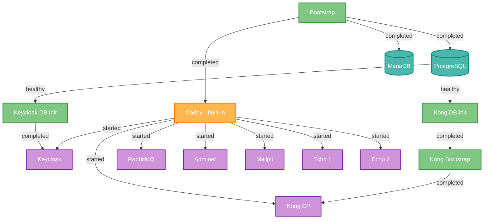

# DcmBase

Infrastructure services package for [DCM](https://github.com/apug/DCM) (Docker Collection Manager). Provides the core components for a local development environment: databases, identity management, API gateway, and message broker.

The reverse proxy (Caddy) is a built-in DCM service and is enabled automatically by `dcm init`.

## Services

| Service | Image | URL | Description |
|---------|-------|-----|-------------|
| **PostgreSQL** | `postgres:17-alpine` | `localhost:5432` | Relational database (used by Kong, Keycloak) |
| **MariaDB** | `mariadb:lts` | `localhost:3306` | MySQL-compatible database |
| **Keycloak** | Custom (Dockerfile) | `https://kc.${CADDY_MAIN_DOMAIN}` | Identity & Access Management (OpenID Connect, SAML) |
| **Kong** | `kong/kong-gateway:3.10` | `https://kong.${CADDY_MAIN_DOMAIN}` (GUI)<br>`https://api.${CADDY_MAIN_DOMAIN}` (Gateway) | API Gateway |
| **RabbitMQ** | `rabbitmq:4-management` | `https://rabbit.${CADDY_MAIN_DOMAIN}` | Message broker with Management UI |
| **Adminer** | `adminer` | `https://adminer.${CADDY_MAIN_DOMAIN}` | Web UI for database management |
| **Mailpit** | `axllent/mailpit` | `https://${MAILPIT_DOMAIN}` (GUI)<br>`mailpit:1025` (SMTP) | SMTP testing server with web UI |
| **Echo** | `mendhak/http-https-echo` | `https://echo1.${CADDY_MAIN_DOMAIN}`<br>`https://echo2.${CADDY_MAIN_DOMAIN}` | Two echo server instances for HTTP testing |

## Setup with DCM

```bash
# Register and clone the repository
dcm repo register git@github.com:myorg/dcm-base.git
dcm repo update

# Enable desired services (interactive)
dcm service enable

# Or enable all at once without prompts
dcm service enable --yes

# Or enable specific services
dcm service enable DcmBase/Postgres DcmBase/Keycloak DcmBase/Kong

# Start the stack
dcm service up
```

## Dependency Graph



## Service Details

### PostgreSQL

Primary relational database. Used as the backend for Kong and Keycloak.

Each service that requires a PostgreSQL database includes an init script in `setup/db/` that automatically creates a dedicated user and database.

**Exposed port**: 5432

### MariaDB

MySQL-compatible database. Includes init scripts in `init/`:

- `00-create-webdev-user.sql` — creates a `webdev` user with full access

General query log enabled for debugging (`--general-log=1`).

**Exposed port**: 3306

### Keycloak

Identity provider with OpenID Connect and SAML support. Custom build optimized with `kc.sh build`.

The `keycloak-db-init` init container automatically creates the user and database on PostgreSQL before startup.

**URLs**:
- Console: `https://kc.${CADDY_MAIN_DOMAIN}`
- Admin: `https://kcadmin.${CADDY_MAIN_DOMAIN}`

**Resources**: max 2 CPU, 2 GB RAM

### Kong

API Gateway with bootstrap + control plane architecture:

1. `kong-db-init` — creates user and database on PostgreSQL
2. `kong-bootstrap` — runs database migrations
3. `kong-cp` — control plane with Admin API and Manager GUI

**URLs**:
- Manager GUI: `https://kong.${CADDY_MAIN_DOMAIN}`
- Admin API: `https://kong.${CADDY_MAIN_DOMAIN}/admin`
- Gateway Proxy: `https://api.${CADDY_MAIN_DOMAIN}`

> The Admin API has no authentication. In production, protect it with RBAC or restrict access by IP.

### RabbitMQ

Message broker with Management UI. Built-in healthcheck via `rabbitmq-diagnostics ping`.

**URL**: `https://rabbit.${CADDY_MAIN_DOMAIN}`

**Resources**: max 1 GB RAM

### Adminer

Stateless web UI for database management, requires no configuration. Connected to both `web` and `db` networks to access the reverse proxy and databases.

**URL**: `https://adminer.${CADDY_MAIN_DOMAIN}`

### Mailpit

SMTP testing server with web UI. Accepts all outgoing mail from services on the Docker network without delivering it externally — useful for development.

**SMTP**: `mailpit:1025` (internal Docker network, no TLS required)

**URL**: `https://${MAILPIT_DOMAIN}` (default: `mail.${CADDY_MAIN_DOMAIN}`)

Configure services to use `MAILPIT_SMTP_HOST` and `MAILPIT_SMTP_PORT` from `config.env`.

### Echo

Two instances of `mendhak/http-https-echo` for HTTP testing and debugging. Each request returns a JSON with headers, body, method, and other details of the received request.

**URLs**:
- `https://echo1.${CADDY_MAIN_DOMAIN}`
- `https://echo2.${CADDY_MAIN_DOMAIN}`

```bash
# Test
curl -k https://echo1.${CADDY_MAIN_DOMAIN}
curl -k -X POST -d '{"test": true}' https://echo2.${CADDY_MAIN_DOMAIN}
```

## Docker Networks

- **web** — services exposed through Caddy (reverse proxy)
- **db** — internal communication with databases

## Service Structure Convention

Each service follows the DCM convention:

```
services/<ServiceName>/
  compose.yml              # Docker Compose definition
  setup/
    config.sh              # Interactive configuration script
    Caddyfile              # Reverse proxy block for Caddy (optional)
    db/                    # Database init scripts (optional)
  init/                    # Container init scripts (optional)
  Dockerfile               # Custom build (optional)
```

## Notes

- All services use internal TLS certificates generated by Caddy (use `-k` with curl)
- Persistent data is stored in `${DCM_VOLUMES_DIR}/DcmBase/<ServiceName>/`
- Services are referenced as `DcmBase/<ServiceName>` in DCM commands
