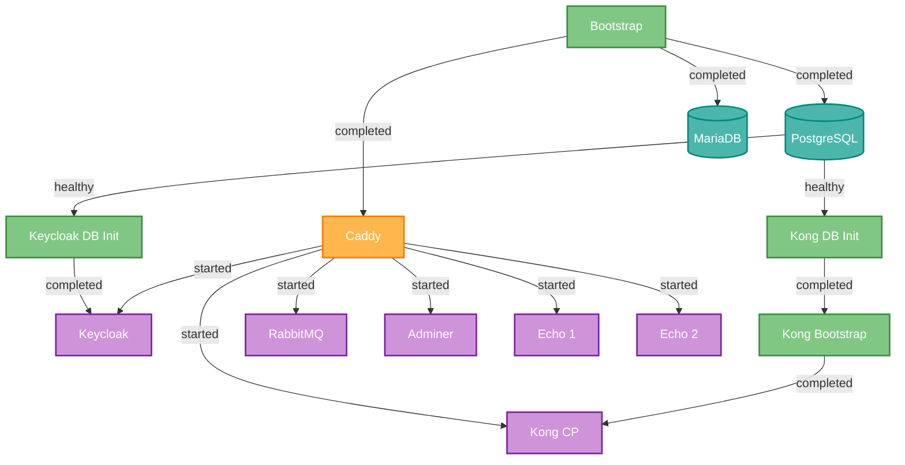

# DcmBase

Pacchetto di servizi infrastrutturali per [DCM](https://github.com/…/DCM) (Docker Collection Manager). Fornisce i componenti di base per un ambiente di sviluppo locale: reverse proxy, database, identity management, API gateway e message broker.

## Servizi

| Servizio | Immagine | URL | Descrizione |
|----------|----------|-----|-------------|
| **Caddy** | Custom (Dockerfile) | - | Reverse proxy con TLS automatico interno |
| **PostgreSQL** | `postgres:17-alpine` | `localhost:5432` | Database relazionale (usato da Kong, Keycloak) |
| **MariaDB** | `mariadb:lts` | `localhost:3306` | Database MySQL-compatible |
| **Keycloak** | Custom (Dockerfile) | `https://kc.${CADDY_MAIN_DOMAIN}` | Identity & Access Management (OpenID Connect, SAML) |
| **Kong** | `kong/kong-gateway:3.10` | `https://kong.${CADDY_MAIN_DOMAIN}` (GUI)<br>`https://api.${CADDY_MAIN_DOMAIN}` (Gateway) | API Gateway |
| **RabbitMQ** | `rabbitmq:4-management` | `https://rabbit.${CADDY_MAIN_DOMAIN}` | Message broker con Management UI |
| **Adminer** | `adminer` | `https://adminer.${CADDY_MAIN_DOMAIN}` | UI web per gestione database |
| **Echo** | `mendhak/http-https-echo` | `https://echo1.${CADDY_MAIN_DOMAIN}`<br>`https://echo2.${CADDY_MAIN_DOMAIN}` | Due istanze echo server per test HTTP |

## Setup con DCM

```bash
# Abilitare i servizi desiderati
dcm service enable DcmBase/Caddy
dcm service enable DcmBase/Postgres
dcm service enable DcmBase/Keycloak
# ...

# Configurare ogni servizio (credenziali, dominio, ecc.)
dcm service config DcmBase/Caddy
dcm service config DcmBase/Postgres
dcm service config DcmBase/Keycloak
# ...

# Avviare lo stack
dcm service up
```

## Grafico delle Dipendenze



## Dettagli Servizi

### Caddy

Reverse proxy con TLS interno per sviluppo locale. Build custom con plugin `caddy-dns/ionos`.

La configurazione Caddy viene composta da tre file generati durante `dcm service config`:

- `Caddyfile.Before` — snippet e opzioni globali (gestito manualmente)
- `Caddyfile.Services` — blocchi reverse proxy per servizio (generato da `dcm service enable/disable`)
- `Caddyfile.After` — catch-all e redirect globali (gestito manualmente)

**Porte esposte**: 80 (HTTP), 443 (HTTPS + HTTP/3)

### PostgreSQL

Database relazionale primario. Utilizzato come backend per Kong e Keycloak.

Ogni servizio che necessita di un database PostgreSQL include uno script di inizializzazione in `setup/db/` che crea automaticamente utente e database dedicati.

**Porta esposta**: 5432

### MariaDB

Database MySQL-compatible. Include script di inizializzazione in `init/`:

- `00-create-webdev-user.sql` — crea utente `webdev` con accesso completo
- `01-init-globetrotter-db.sh` — inizializza database per servizi esterni che lo richiedono

General query log attivo per debug (`--general-log=1`).

**Porta esposta**: 3306

### Keycloak

Identity provider con supporto OpenID Connect e SAML. Build custom ottimizzata con `kc.sh build`.

Container di inizializzazione `keycloak-db-init` crea automaticamente utente e database su PostgreSQL prima dell'avvio.

**URL**:
- Console: `https://kc.${CADDY_MAIN_DOMAIN}`
- Admin: `https://kcadmin.${CADDY_MAIN_DOMAIN}`

**Risorse**: max 2 CPU, 2 GB RAM

### Kong

API Gateway con architettura bootstrap + control plane:

1. `kong-db-init` — crea utente e database su PostgreSQL
2. `kong-bootstrap` — esegue le migrazioni del database
3. `kong-cp` — control plane con Admin API e Manager GUI

**URL**:
- Manager GUI: `https://kong.${CADDY_MAIN_DOMAIN}`
- Admin API: `https://kong.${CADDY_MAIN_DOMAIN}/admin`
- Gateway Proxy: `https://api.${CADDY_MAIN_DOMAIN}`

> Le Admin API non hanno autenticazione. In produzione, proteggerle con RBAC o limitare l'accesso per IP.

### RabbitMQ

Message broker con Management UI. Healthcheck integrato via `rabbitmq-diagnostics ping`.

**URL**: `https://rabbit.${CADDY_MAIN_DOMAIN}`

**Risorse**: max 1 GB RAM

### Adminer

UI web per gestione database. Stateless, non richiede configurazione. Collegato alle reti `web` e `db` per accedere sia al reverse proxy che ai database.

**URL**: `https://adminer.${CADDY_MAIN_DOMAIN}`

### Echo

Due istanze di `mendhak/http-https-echo` per test e debug HTTP. Ogni richiesta restituisce un JSON con headers, body, metodo e altre informazioni della richiesta ricevuta.

**URL**:
- `https://echo1.${CADDY_MAIN_DOMAIN}`
- `https://echo2.${CADDY_MAIN_DOMAIN}`

```bash
# Test
curl -k https://echo1.${CADDY_MAIN_DOMAIN}
curl -k -X POST -d '{"test": true}' https://echo2.${CADDY_MAIN_DOMAIN}
```

## Reti Docker

- **web** — servizi esposti tramite Caddy (reverse proxy)
- **db** — comunicazione interna con i database

## Struttura del Servizio

Ogni servizio segue la convenzione DCM:

```
services/<NomeServizio>/
  compose.yml              # Definizione Docker Compose
  setup/
    config.sh              # Script di configurazione interattivo
    Caddyfile              # Blocco reverse proxy per Caddy (opzionale)
    db/                    # Script di init database (opzionale)
  init/                    # Script di inizializzazione container (opzionale)
  Dockerfile               # Build custom (opzionale)
```

## Configurazione

Il dominio principale (`CADDY_MAIN_DOMAIN`) viene impostato durante `dcm service config DcmBase/Caddy` e utilizzato da tutti i servizi per generare gli URL dei sottodomini.

Ogni servizio con stato (database, broker, ecc.) chiede interattivamente le credenziali durante la configurazione, proponendo valori di default per sviluppo locale.

## Note

- Tutti i servizi usano certificati TLS interni generati da Caddy (flag `-k` con curl)
- I dati persistenti sono salvati in `${DCM_VOLUMES_DIR}/DcmBase/<NomeServizio>/`
- I servizi sono indirizzati come `DcmBase/<NomeServizio>` nei comandi DCM
